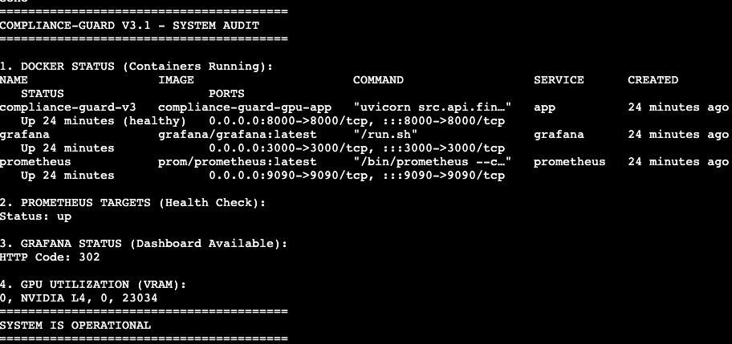
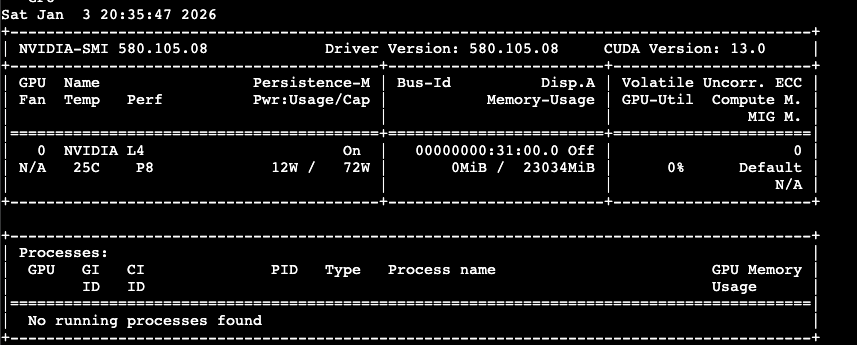

# Compliance Guard v3.1

Automated NIST Compliance Analysis using Fine-Tuned LLM with Production-Grade Infrastructure

[](https://www.python.org/downloads/)
[](https://fastapi.tiangolo.com/)
[](https://www.docker.com/)
[](LICENSE)

---

## Table of Contents

- [Overview](#overview)
- [Architecture](#architecture)
- [Features](#features)
- [Performance Metrics](#performance-metrics)
- [Installation](#installation)
- [API Reference](#api-reference)
- [Monitoring](#monitoring)
- [System Validation](#system-validation)
- [License](#license)

---

## Overview

Compliance Guard automates NIST cybersecurity compliance analysis using a fine-tuned Mistral-7B language model with LoRA adapters. The system implements production-grade patterns including 4-bit quantization, intelligent caching, rate limiting, and comprehensive observability.

### Technical Stack

**Model Architecture**
- Base Model: Mistral-7B-v0.1
- Fine-Tuning: LoRA (PEFT) adapters
- Quantization: 4-bit BitsAndBytes (15GB → 5GB VRAM)
- Training: 1000 steps, final loss 0.45

**Backend Infrastructure**
- API Framework: FastAPI + Uvicorn
- Rate Limiting: SlowAPI (10 req/min per IP)
- Caching: MD5-based disk cache
- Vector Store: FAISS (local index)

**Observability Stack**
- Metrics: Prometheus
- Visualization: Grafana
- Logging: Structured Python logging

**Deployment**
- Containerization: Docker + Docker Compose
- Infrastructure: AWS G4DN (NVIDIA Tesla T4)
- OS: Amazon Linux 2

---

## Architecture
```
┌─────────────────────────────────────────────────────────────┐
│                     Client Application                       │
└─────────────────────┬───────────────────────────────────────┘
                      │
                      ▼
┌─────────────────────────────────────────────────────────────┐
│                FastAPI Server (Port 8000)                    │
│  ┌──────────────┐  ┌──────────────┐  ┌──────────────┐      │
│  │ Rate Limiter │→ │ Cache Layer  │→ │  Validation  │      │
│  │  (SlowAPI)   │  │   (MD5/Disk) │  │  (Keywords)  │      │
│  └──────────────┘  └──────────────┘  └──────────────┘      │
│                           │                                  │
│                           ▼                                  │
│                  ┌─────────────────┐                        │
│                  │  Mistral-7B     │                        │
│                  │  4-bit Quant    │                        │
│                  │  + LoRA         │                        │
│                  └─────────────────┘                        │
└─────────────────────┬───────────────────────────────────────┘
                      │
        ┌─────────────┴─────────────┐
        ▼                           ▼
┌───────────────┐         ┌──────────────┐
│  Prometheus   │────────▶│   Grafana    │
│  (Port 9090)  │         │ (Port 3000)  │
└───────────────┘         └──────────────┘
```

### System Components

**1. API Server (compliance-guard-v3)**
- Handles inference requests
- Implements security validations
- Manages cache operations
- Exposes Prometheus metrics

**2. Prometheus**
- Scrapes metrics every 60 seconds
- Stores time-series data
- Retention: 30 days

**3. Grafana**
- Real-time dashboard visualization
- Pre-configured datasource
- Admin credentials: admin/admin

---

## Features

### Security & Validation

**Rate Limiting**
- 10 requests per minute per IP address
- Automatic 429 response on limit exceeded

**Input Validation**
- Maximum input length: 500 characters
- Forbidden keyword detection: ["ignore", "jailbreak", "system", "instructions"]
- Graceful degradation on model failure (503 Service Unavailable)

### Performance Optimization

**4-bit Quantization**
- Reduces VRAM usage from 15GB to 5GB
- Enables deployment on single G4DN instance
- Configuration: NF4 with double quantization

**Intelligent Caching**
- MD5-based exact match caching
- Disk-persistent cache storage
- Latency reduction: 8.6s → 0.01s for cached queries

**LoRA Adapters**
- Parameter-efficient fine-tuning
- Adapter size: 52MB
- Domain-specific compliance knowledge

### Observability

**Prometheus Metrics**
- `compliance_request_total`: Total requests by method, endpoint, status
- `compliance_latency_seconds`: Inference duration histogram
- `cache_hit_total`: Cache hit counter
- `cache_miss_total`: Cache miss counter
- `user_feedback_total`: Feedback submissions by rating
- `active_requests`: Current concurrent requests

**Health Monitoring**
- `/health` endpoint with Docker healthcheck integration
- 30-second interval checks with 3 retries
- 60-second startup grace period

---

## Performance Metrics

### Validation Results

**Golden Set Evaluation (50 test cases)**
- Success Rate: 96.0% (48/50 passed)
- Failed Cases: 2
- Average Latency: 8.62 seconds (cold start)
- Cached Latency: ~0.01 seconds

### Resource Utilization

| Metric | Value |
|--------|-------|
| Container Memory Usage | 13.9GB / 15GB (92.6%) |
| Model Size (Quantized) | ~5GB VRAM |
| Model Size (Full Precision) | 15GB |
| LoRA Adapter Size | 52MB |
| CPU Usage | ~30% |
| Active PIDs | 17 |

### Training Metrics

| Metric | Value |
|--------|-------|
| Total Steps | 1000 |
| Final Loss | 0.45 |
| Dataset Size | 50 chunks |
| Checkpoints | 2 (step-25, step-50) |

---

## Installation

### Prerequisites

- Docker 20.10+
- Docker Compose 1.29+
- NVIDIA GPU with CUDA support
- NVIDIA Docker Runtime
- 20GB free disk space
- 16GB RAM minimum

### Quick Start

**1. Clone Repository**
```bash
git clone https://github.com/cesaremcasa/compliance-guard.git
cd compliance-guard-gpu
```

**2. Build and Start Services**
```bash
docker-compose up -d --build
```

**3. Verify Deployment**
```bash
# Check container status
docker-compose ps

# Verify health endpoint
curl http://localhost:8000/health

# Expected output:
# {"status":"healthy","model_loaded":true}
```

**4. Run Validation Tests**
```bash
python3 scripts/run_batch_validation.py
```

### Container Services

| Service | Port | Description |
|---------|------|-------------|
| app | 8000 | FastAPI application |
| prometheus | 9090 | Metrics scraper |
| grafana | 3000 | Dashboard (admin/admin) |

---

## API Reference

### POST /generate

Generate compliance analysis response.

**Request Body**
```json
{
  "text": "What are the access control requirements for AC-2?"
}
```

**Response**
```json
{
  "request_id": "a3f2c1b8e4d5",
  "generated_text": "AC-2 requires organizations to...",
  "cached": false,
  "latency_seconds": 8.2341
}
```

**Status Codes**
- 200: Success
- 400: Invalid input (length exceeded or forbidden keywords)
- 429: Rate limit exceeded
- 503: Model not loaded

### POST /feedback

Submit user feedback for continuous improvement.

**Request Body**
```json
{
  "request_id": "a3f2c1b8e4d5",
  "rating": 5,
  "comment": "Accurate and comprehensive response"
}
```

**Response**
```json
{
  "status": "success",
  "message": "Feedback received. Thank you!"
}
```

**Constraints**
- Rating: Integer between 1 and 5
- Comment: Optional string

### GET /health

Health check endpoint for container orchestration.

**Response**
```json
{
  "status": "healthy",
  "model_loaded": true
}
```

### GET /metrics

Prometheus-compatible metrics endpoint.

**Response Format**: Prometheus text exposition format

### GET /stats

Internal statistics endpoint.

**Response**
```json
{
  "cache_entries": 42,
  "model_loaded": true,
  "device": "cuda"
}
```

---

## Monitoring

### Grafana Dashboard

Access at `http://localhost:3000`

**Default Credentials**
- Username: admin
- Password: admin

**Available Metrics**
- Request rate (req/s)
- Latency percentiles (p50, p95, p99)
- Cache hit rate
- Error rate by status code
- Active requests gauge

### Prometheus Queries

**Cache Hit Rate**
```promql
rate(cache_hit_total[5m]) / 
(rate(cache_hit_total[5m]) + rate(cache_miss_total[5m]))
```

**Average Latency**
```promql
rate(compliance_latency_seconds_sum[5m]) / 
rate(compliance_latency_seconds_count[5m])
```

**Request Throughput**
```promql
sum(rate(compliance_request_total[1m])) by (status)
```

---

## Project Structure
```
compliance-guard-gpu/
├── src/
│   ├── api/
│   │   ├── __init__.py
│   │   ├── final_server_v3.py       # Main API server
│   │   └── simple_server_v2.py      # Simplified version
│   ├── rag/
│   │   ├── __init__.py
│   │   ├── ingest.py                # Document ingestion
│   │   └── retriever.py             # FAISS retrieval
│   └── training/
│       ├── generate_dataset.py      # Dataset creation
│       └── train.py                 # LoRA fine-tuning
├── models/
│   └── checkpoints/                 # LoRA adapters
│       ├── adapter_config.json
│       ├── adapter_model.safetensors
│       └── checkpoint-{25,50}/
├── data/
│   └── processed/
│       └── faiss_index.bin/         # Vector index
├── tests/
│   └── golden_set.json              # Validation dataset
├── scripts/
│   └── run_batch_validation.py      # Test runner
├── docker-compose.yml               # Service orchestration
├── Dockerfile                       # Container image
├── prometheus.yml                   # Metrics configuration
├── requirements.txt                 # Python dependencies
└── README.md
```

---

## System Validation

### Production Deployment Status



### GPU Resource Utilization




---

## Technical Debt & Known Issues

**Limitations**
- Single GPU instance (no horizontal scaling)
- Disk I/O bottleneck under high concurrency (mitigated via 4-bit quantization)
- Cache lacks TTL mechanism (manual cleanup required)

**Mitigation Strategies**
- 4-bit quantization reduces memory pressure
- Rate limiting prevents resource exhaustion
- Health checks enable automatic restart on failure

---

## License

MIT License

Copyright (c) 2026 Cesar Augusto

Permission is hereby granted, free of charge, to any person obtaining a copy
of this software and associated documentation files (the "Software"), to deal
in the Software without restriction, including without limitation the rights
to use, copy, modify, merge, publish, distribute, sublicense, and/or sell
copies of the Software, and to permit persons to whom the Software is
furnished to do so, subject to the following conditions:

The above copyright notice and this permission notice shall be included in all
copies or substantial portions of the Software.

THE SOFTWARE IS PROVIDED "AS IS", WITHOUT WARRANTY OF ANY KIND, EXPRESS OR
IMPLIED, INCLUDING BUT NOT LIMITED TO THE WARRANTIES OF MERCHANTABILITY,
FITNESS FOR A PARTICULAR PURPOSE AND NONINFRINGEMENT. IN NO EVENT SHALL THE
AUTHORS OR COPYRIGHT HOLDERS BE LIABLE FOR ANY CLAIM, DAMAGES OR OTHER
LIABILITY, WHETHER IN AN ACTION OF CONTRACT, TORT OR OTHERWISE, ARISING FROM,
OUT OF OR IN CONNECTION WITH THE SOFTWARE OR THE USE OR OTHER DEALINGS IN THE
SOFTWARE.

---

## Author

**Cesar Augusto**  
AI Systems Engineer  
[GitHub](https://github.com/cesaremcasa) | [Email](mailto:cesardonahill3@gmail.com)

Specializing in Agentic AI, LLM orchestration, and production ML systems.

---

**System Status**: Production Ready  
**Last Updated**: January 2026  
**Documentation Version**: 3.1
